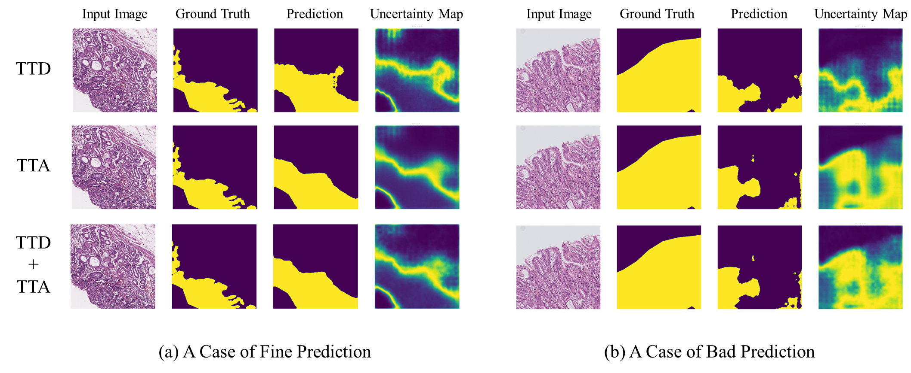
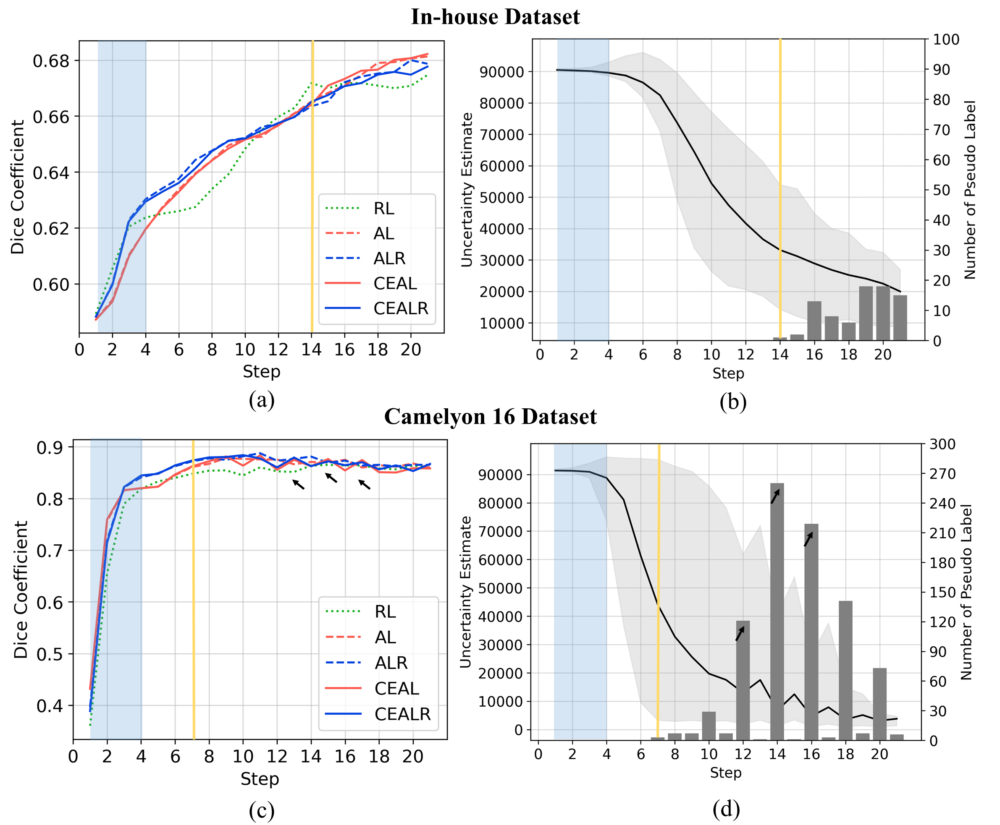

# active-learning
This is a PyTorch implementation of our MedAGI(MICCAI 2023 1st International Workshop on Foundation Models for General Medical AI) poster [Revisiting Active Learning in Histopathology Segmentation: Representativeness and Cost-Effective Active Learning](https://medagi.github.io/#/program)

### Uncertainty Estimation Method Comparision

*TTD: Test Time Dropout, TTA: Test Time Augmentation*

- When the prediction results are good (left), the method that considers both TTA and TTD estimates lower uncertainty compared to the method that considers only TTD.
- Conversely, in the opposite case (right), it estimates higher uncertainty.

### Active Learning

*RL: Random Learning, [AL](https://github.com/gotjd709/active-learning/blob/f1c0988de96073e7b570950da17d33e52794f14f/script/util.py#L232): Active Learning, [ALR](https://github.com/gotjd709/active-learning/blob/f1c0988de96073e7b570950da17d33e52794f14f/script/util.py#L248): Active Learning with Representativeness, [CEAL](https://github.com/gotjd709/active-learning/blob/f1c0988de96073e7b570950da17d33e52794f14f/script/util.py#L272): Cost-Effective Active Learning, [CEALR](https://github.com/gotjd709/active-learning/blob/f1c0988de96073e7b570950da17d33e52794f14f/script/util.py#L309): CEAL with Representativeness*

- When there is no difference in uncertainty estimation intervals (light blue region), AL and CEAL methods lag behind ALR and CEALR methods, but they catch up in performance when intervals diverge.

- As the estimation of uncertainty decreases and the use of pseudo labels begins (yellow line), differences arise depending on the presence of CEAL.

### Reference

1. Wang, G., Li, W., Aertsen, M., Deprest, J., Ourselin, S., and Vercauteren, T.
Aleatoric uncertainty estimation with test-time augmentation for medical image segmentation with convolutional neural networks. Neurocomputing, 338:34–45, 2019.

2. Wang, K., Zhang, D., Li, Y., Zhang, R., and Lin, L. Cost-effective active learning
for deep image classification. IEEE Transactions on Circuits and Systems for Video
Technology, 27(12):2591–2600, 2016.

3. Yang, L., Zhang, Y., Chen, J., Zhang, S., and Chen, D. Z. Suggestive annotation: A
deep active learning framework for biomedical image segmentation. In Medical Image Computing and Computer Assisted Intervention- MICCAI 2017: 20th International Conference, Quebec City, QC, Canada, September 11-13, 2017, Proceedings,
Part III 20, pp. 399–407. Springer, 2017
